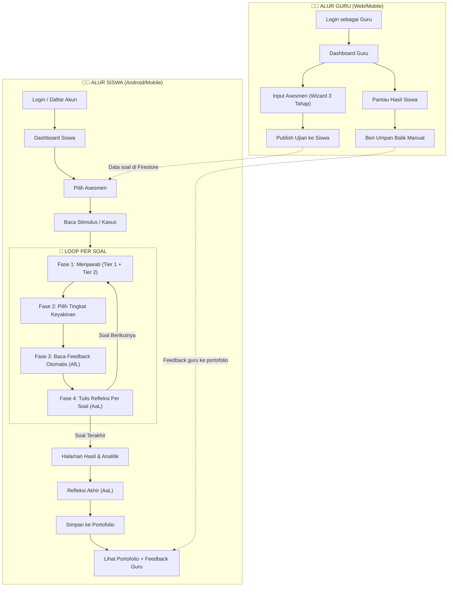

# Alur End-to-End Instrumen Asesmen
## Aplikasi Mobile Assessment for Learning & As Learning pada Deep Learning Informatika SMP

---

## Ringkasan Kerangka Teoritis

| Konsep | Peran dalam Aplikasi |
|--------|---------------------|
| **Assessment for Learning (AfL)** | Feedback otomatis per soal & feedback agregat untuk memperbaiki pemahaman |
| **Assessment as Learning (AaL)** | Refleksi per soal & refleksi akhir untuk mendorong kesadaran berpikir (metakognisi) |
| **Deep Learning** | Proses bermakna, sadar, dan reflektif melalui stimulus kontekstual + penalaran bertingkat |

---

## Diagram Alur Utama



---

## Detail Alur Guru

### 1. Login sebagai Guru
- **Layar**: `RoleSelectionScreen` → `AdminLoginScreen`
- **Aksi**: Guru memilih peran "Guru" → memasukkan kredensial admin
- **Tujuan**: Mengakses dasbor pengelolaan asesmen

### 2. Dashboard Guru (`AdminDashboardLayout`)
- **Tampilan**: Daftar semua bank asesmen yang sudah dibuat
- **Informasi per kartu**: Judul, mata pelajaran, durasi, status (Aktif/Draft), gambar sampul
- **Aksi**: Klik kartu → Pantau hasil siswa | Klik ikon 🗑️ → Hapus asesmen

### 3. Input Asesmen — Wizard 3 Tahap (`IntegratedAssessmentForm`)

| Tahap | Judul | Isi |
|-------|-------|-----|
| **1** | Info Bank Soal | Judul asesmen, mata pelajaran, nama guru, durasi (menit), link gambar sampul |
| **2** | Kasus / Stimulus | Judul topik pembacaan, narasi panjang cerita/kasus, tabel pendukung (opsional) |
| **3** | Daftar Soal Two-Tier | Pertanyaan + level kognitif + **Tier 1** (4 opsi jawaban + pilih jawaban benar) + **Tier 2** (4 alasan + bobot + **pilih alasan benar**) |

> **Catatan Penting**: Di Tahap 3 Tier 2, guru **wajib** menandai satu alasan sebagai "alasan benar" menggunakan radio button. Ini menentukan klasifikasi Two-Tier (BB/BS/SB/SS) saat penilaian otomatis.

### 4. Publish Ujian
- **Aksi**: Klik tombol "Publish Ujian Ke Siswa" → Data tersimpan ke Firestore (`assessment_banks`, `stimulus`, `questions`)
- **Hasil**: Asesmen langsung muncul di dashboard siswa

### 5. Pantau Hasil Siswa (`AdminResultsScreen`)
- **Tampilan per siswa**:
  - Persentase skor total
  - Distribusi kategori: **BB** (hijau), **BS** (oranye), **SB** (kuning), **SS** (merah)
  - Status feedback: "Terkirim" atau "Beri Feedback"
- **Detail (klik kartu siswa)**:
  - Breakdown skor per soal (kategori + skor + confidence + waktu)
  - Refleksi per soal (apa yang dipelajari + kesulitan)
  - Refleksi akhir siswa (bagian tersulit + strategi belajar)
  - **Form input umpan balik guru** → Kirim ke portofolio siswa

### 6. Beri Umpan Balik Manual
- Guru mengetikkan catatan apresiasi/evaluasi → Klik "Kirim ke Siswa"
- Feedback tersimpan di field `teacherFeedback` pada `assessment_results` di Firestore
- Muncul otomatis di portofolio digital siswa

---

## Detail Alur Siswa

### 1. Login / Daftar Akun
- **Layar**: `RoleSelectionScreen` → `AuthGate` → `LoginScreen`
- **Metode**: Email + Password (Firebase Authentication)
- **Multi-user**: Setiap siswa memiliki UID unik; data terpisah otomatis

### 2. Dashboard Siswa (`DashboardScreen`)
- **Header**: Nama siswa, kelas
- **Konten**: Daftar asesmen yang tersedia (dari Firestore `assessment_banks`)
- **Navigasi bawah**: Dashboard | Portofolio | Profil

### 3. Pilih Asesmen & Baca Stimulus
- **Layar**: `UnderstandingScreen` (Fase 1: Understanding)
- **Konten**: Judul topik + narasi stimulus/kasus kontekstual yang dimuat dari Firestore
- **Tujuan Deep Learning**: Siswa memahami konteks sebelum menjawab
- **Aksi**: Klik "Mulai Asesmen" → masuk ke layar ujian

### 4. Pengerjaan Soal — Loop 4 Fase per Soal (`AssessmentScreen`)

Setiap soal melewati **4 fase berurutan** dalam satu layar yang berubah dinamis:

---

#### Fase 1: MENJAWAB (Answering)
- **Tujuan**: Mengukur pemahaman kognitif bertingkat
- **Tampilan**:
  - Card stimulus/kasus (ringkasan)
  - Teks pertanyaan
  - **Tier 1**: 4 opsi jawaban pilihan ganda (radio select)
  - **Tier 2**: Muncul setelah Tier 1 dipilih — 4 opsi alasan/penalaran (radio select)
- **Pencatatan waktu**: Stopwatch internal mulai berjalan otomatis saat soal ditampilkan
- **Validasi**: Kedua tier harus dipilih sebelum tombol "Simpan Jawaban" aktif
- **Proses di belakang layar saat submit**:
  - Stopwatch berhenti → catat `timeTakenSeconds`
  - Klasifikasi: `tier1Correct` & `tier2Correct` → kategori BB/BS/SB/SS
  - Hitung `twoTierScore` (0/1/2) dan `timeScore` (0/0.25/0.5)

---

#### Fase 2: KEYAKINAN (Confidence)
- **Tujuan**: Mengukur dimensi metakognitif (AaL)
- **Tampilan**: 4 kartu dengan emoji dan warna berbeda:

| Level | Label | Emoji | Klasifikasi |
|-------|-------|-------|-------------|
| 1 | Sangat Tidak Yakin | 😟 | TY (Tidak Yakin) |
| 2 | Tidak Yakin | 😕 | TY (Tidak Yakin) |
| 3 | Yakin | 😊 | Y (Yakin) |
| 4 | Sangat Yakin | 😄 | Y (Yakin) |

- **Proses di belakang layar saat memilih**:
  - Hitung `confidenceScore` berdasarkan matriks kategori × keyakinan
  - Hitung `totalItemScore` = twoTier + confidence + time
  - Generate feedback otomatis via `FeedbackGenerator`

---

#### Fase 3: FEEDBACK (Assessment for Learning)
- **Tujuan**: Memberikan umpan balik langsung untuk memperbaiki pemahaman
- **Tampilan**:
  - **Badge kategori**: BB (hijau) / BS (oranye) / SB (kuning) / SS (merah)
  - **Koreksi jawaban**: Jawaban siswa vs kunci jawaban (Tier 1 & Tier 2)
  - **Card feedback paragraf**: Teks otomatis dalam Bahasa Indonesia sederhana (4 komponen: hasil utama + arahan + confidence + waktu)
  - **Breakdown skor**: Two-Tier | Keyakinan | Waktu (masing-masing ditampilkan terpisah)
- **Contoh output feedback**:
  > *"Jawabanmu benar, tapi alasan yang kamu pilih belum tepat. Coba perbaiki pemahamanmu tentang alasan di balik jawaban. Kamu merasa yakin, tapi masih ada kesalahan — cek ulang pemahamanmu. Kamu mengerjakan dengan cepat."*

---

#### Fase 4: REFLEKSI PER SOAL (Assessment as Learning)
- **Tujuan**: Mendorong siswa merefleksikan proses berpikirnya sendiri
- **Tampilan**: 2 text field refleksi:
  1. *"Apa yang kamu pelajari dari soal ini?"*
  2. *"Apa kesalahanmu atau yang masih sulit?"*
- **Validasi**: Minimal 3 karakter per field
- **Aksi**:
  - Jika **bukan soal terakhir** → Lanjut ke soal berikutnya (kembali ke Fase 1)
  - Jika **soal terakhir** → Simpan semua data ke Firestore → Halaman Hasil

---

### 5. Halaman Hasil & Analitik (`ResultScreen`)
- **Tampilan**:
  - **Skor utama**: Persentase dalam lingkaran progress + skor mentah
  - **Distribusi kategori**: 4 chip (BB/BS/SB/SS) dengan jumlah masing-masing
  - **Statistik**: Jumlah soal yakin vs ragu, kategori waktu dominan
  - **Card feedback agregat** (AfL): Paragraf ringkasan analisis + rekomendasi belajar
  - **Detail per soal** (expandable): Kategori, skor, confidence, waktu, refleksi per soal
- **Navigasi**: Tidak ada tombol kembali ke dashboard → **wajib** lanjut ke Refleksi Akhir

### 6. Refleksi Akhir (`ReflectionScreen`)
- **Tujuan**: Refleksi menyeluruh atas pengalaman asesmen (AaL)
- **Tampilan**: 2 pertanyaan refleksi global:
  1. *"Bagian mana yang paling sulit bagimu?"*
  2. *"Apa strategi belajarmu selanjutnya?"*
- **Validasi**: Minimal 5 karakter per field
- **Aksi**: "Simpan ke Portofolio" → update `assessment_results` di Firestore → redirect ke Portofolio

### 7. Portofolio Digital (`PortfolioScreen`)
- **Tampilan per entri**:
  - Persentase skor + skor mentah
  - Distribusi kategori (BB/BS/SB/SS)
  - Tanggal pengerjaan
  - Detail (expandable): Refleksi global + Feedback guru
- **Aksi**: Hapus entri portofolio (dengan konfirmasi dialog)

---

## Rubrik Penilaian

### Komponen 1: Skor Two-Tier (0–2 poin)

| Kategori | Tier 1 (Jawaban) | Tier 2 (Alasan) | Skor | Interpretasi |
|----------|:-:|:-:|:-:|---|
| **BB** | ✅ | ✅ | **2** | Deep Understanding — Paham konsep dan alasan |
| **BS** | ✅ | ❌ | **1** | Surface Understanding — Jawaban hafalan tanpa pemahaman |
| **SB** | ❌ | ✅ | **1** | Possible Misconception — Paham konsep tapi gagal menerapkan |
| **SS** | ❌ | ❌ | **0** | Not Understanding — Belum memahami materi |

### Komponen 2: Skor Confidence (−0.5 s/d +1 poin)

| Kategori | Yakin (Y) | Tidak Yakin (TY) |
|----------|:-:|:-:|
| **BB** | **+1.0** (paham & sadar) | **+0.5** (paham tapi ragu) |
| **BS** | 0 | 0 |
| **SB** | **−0.25** (miskonsepsi tapi yakin) | 0 |
| **SS** | **−0.5** (salah tapi yakin = berbahaya) | 0 |

> **Logika**: Penalti diberikan jika siswa **yakin** padahal jawabannya **salah** — ini mengindikasikan miskonsepsi yang perlu diintervensi.

### Komponen 3: Skor Waktu (0–0.5 poin)

| Kategori | Rentang | Skor |
|----------|---------|:----:|
| **Cepat** | ≤ 30 detik | **+0.5** |
| **Sedang** | 31–120 detik | **+0.25** |
| **Lambat** | > 120 detik | **0** |

> **Catatan**: Waktu bukan penalti melainkan bonus. Tidak ada timer countdown — siswa bebas berpikir selama yang mereka butuhkan. Sistem mencatat durasi secara otomatis menggunakan stopwatch internal.

### Skor Total per Soal

```
Total per Item = Skor Two-Tier + Skor Confidence + Skor Waktu
Maksimal      = 2 + 1 + 0.5 = 3.5 poin
```

### Skor Total Asesmen

```
Total Asesmen  = Σ (Total per Item)
Maksimal       = Jumlah Soal × 3.5
Persentase     = (Total Asesmen / Maksimal) × 100%
```

---

## Struktur Data Firestore

```
📁 assessment_banks/
   └── {bankId}
       ├── title: String
       ├── subject: String
       ├── creator: String
       ├── durationMinutes: int
       ├── imageUrl: String
       ├── isActive: bool
       └── stimulusId: String

📁 stimulus/
   └── {stimulusId}
       ├── title: String
       ├── description: String (narasi panjang)
       └── table: String (opsional)

📁 questions/
   └── {questionId}
       ├── stimulus_id: String
       ├── stimulus: String
       ├── question_text: String
       ├── level: String ("understanding" | "applying" | "reflecting")
       ├── options: List<String> (4 opsi Tier 1)
       ├── correct_answer: int (index jawaban benar)
       ├── reasoning: List<{text, weight}> (4 opsi Tier 2)
       └── correct_reason: int (index alasan benar)

📁 assessment_results/
   └── {resultId}
       ├── assessmentId: String
       ├── userId: String (UID Firebase Auth)
       ├── createdAt: Timestamp
       ├── totalScore: double
       ├── maxPossibleScore: double
       ├── totalTime: int (total detik)
       ├── overallFeedback: String (generated)
       ├── globalReflectionHardest: String?
       ├── globalReflectionStrategy: String?
       ├── teacherFeedback: String?
       └── answers: List<AnswerModel>
            ├── questionId
            ├── selectedOptionIndex, selectedReasonIndex
            ├── tier1Correct, tier2Correct
            ├── category (BB/BS/SB/SS)
            ├── confidenceLevel (1-4), isConfident
            ├── timeTakenSeconds, timeCategory
            ├── twoTierScore, confidenceScore, timeScore, totalItemScore
            ├── feedbackText (generated)
            ├── reflectionLearned?
            └── reflectionDifficulty?
```

---

## Mapping ke Komponen Kode

| Alur | File | Deskripsi |
|------|------|-----------|
| Login & Role | `role_selection_screen.dart`, `auth_gate.dart`, `login_screen.dart` | Pemilihan peran + autentikasi Firebase |
| Dashboard Siswa | `dashboard_screen.dart` | Daftar asesmen + navigasi utama |
| Stimulus | `understanding_screen.dart` | Membaca kasus sebelum ujian |
| Pengerjaan Soal | `assessment_screen.dart` | 4 fase per soal (UI multi-phase) |
| Mesin Penilaian | `scoring_engine.dart` | Klasifikasi & kalkulasi skor |
| Generator Feedback | `feedback_generator.dart` | Template feedback otomatis |
| State Management | `assessment_provider.dart` | State machine + logika bisnis |
| Hasil & Analitik | `result_screen.dart` | Tampilan skor + feedback agregat |
| Refleksi Akhir | `reflection_screen.dart` | 2 pertanyaan refleksi global |
| Portofolio | `portfolio_screen.dart` | Riwayat + feedback guru |
| Dashboard Guru | `admin_dashboard_home.dart` | Daftar bank soal |
| Input Soal | `integrated_assessment_form.dart` | Wizard 3 tahap |
| Pantau Siswa | `admin_results_screen.dart` | Detail + kirim feedback |
| Firestore Service | `admin_firestore_service.dart` | CRUD Firestore |

---

## Platform Deployment

| Target | Cara Akses | Pengguna Utama |
|--------|------------|----------------|
| **Android (.apk)** | Install file APK di HP siswa | Siswa |
| **Web** | Buka `https://integratedasesment.web.app` di browser | Guru + Siswa |

---

*Dokumen ini dibuat sebagai referensi alur end-to-end untuk keperluan skripsi dan pengembangan lanjutan.*
